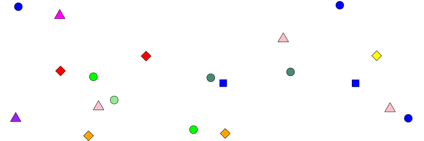
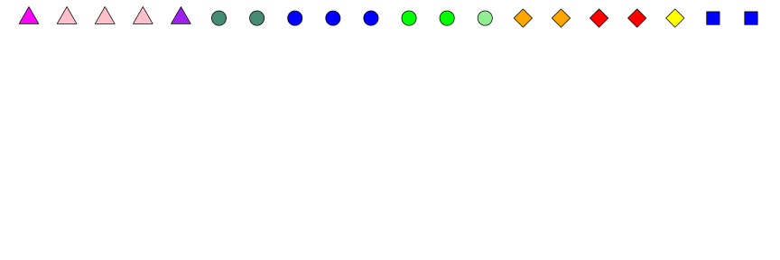
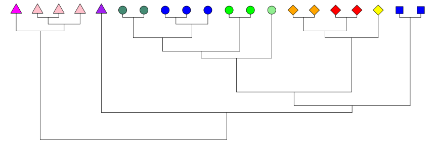
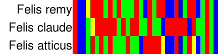
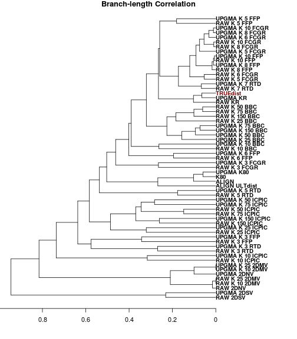
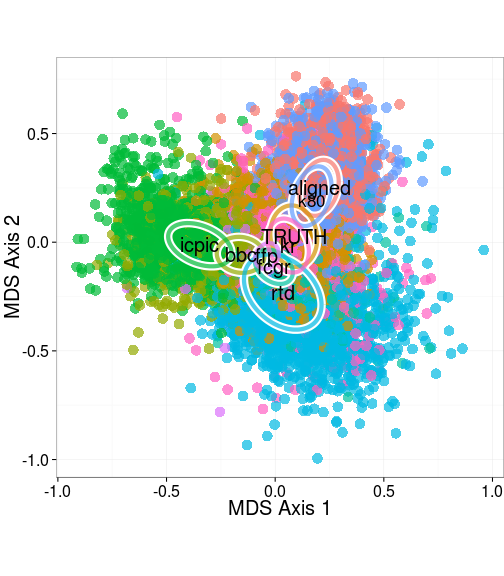
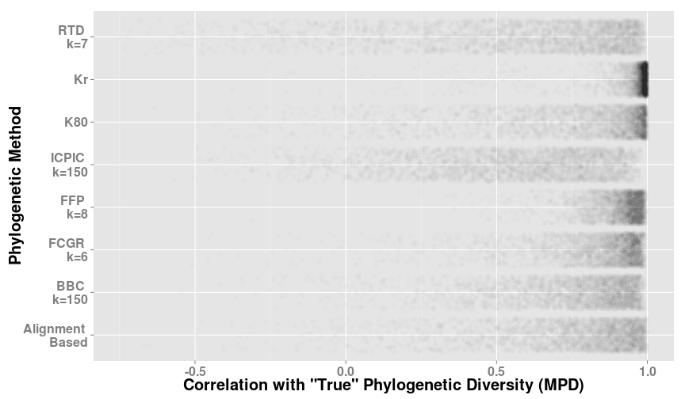

## Understanding Biodiversity of Communities with Thousands (upon Millions) of Species

 

* What is Diversity? 

---

## Understanding Biodiversity of Communities with Thousands (upon Millions) of Species

 

* What is Diversity?
* Some species look (and act) more similar than others.

---

## Understanding Biodiversity of Communities with Thousands (upon Millions) of Species

 

* What is Diversity? 
* Some species look (and act) more similar than others.
* Phylogenetic Diversity - Uses genetic data to estimate potential ecological similarity without measuring traits

--- &twocol

## Phylogenetic Diversity

- Uses genetic data to estimate potential ecological similarity without measuring traits
- For thousands of species, it is still very time consuming
- How can we adapt this useful diversity measure to **_rapid_ biodiversity assessment**?

*** =left

### __Alignment-free Phylogeny__

 

**Four types of alignment-free phylogeny methods**
- *Word Based*, *Substring Based* 
- *Information Theory Based*
- *Graphical*

*** =right

### **Alignment Based Phylogeny**

 

**One alignment-based method**

>- *MUSCLE + RAxML*

--- &twocol

## Alignment-free Phylogenetic Diversity?

*** =left

<video   controls="controls" loop="loop"><source src="assets/fig/treeanimate.ogg" />video of chunk treeanimate</video>

*** =right

- 4000 simulations of phylogenies, genomes, and communities

<---------------

- Calculated Alignment-Free genetic distances and Alignment-based phylogenetic distances
- How well did they capture the 'true'
  1. Branch-length distribution?
  2. Topology?

--- &twocol

## Results

*** =left

 

*** =right

--- &twocol

## Results

*** =left

 

*** =right
 

---

## Results

 

